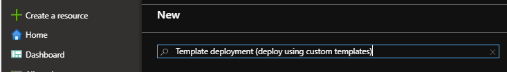
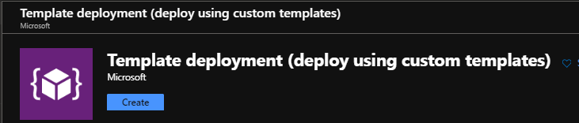
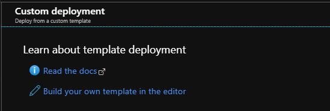
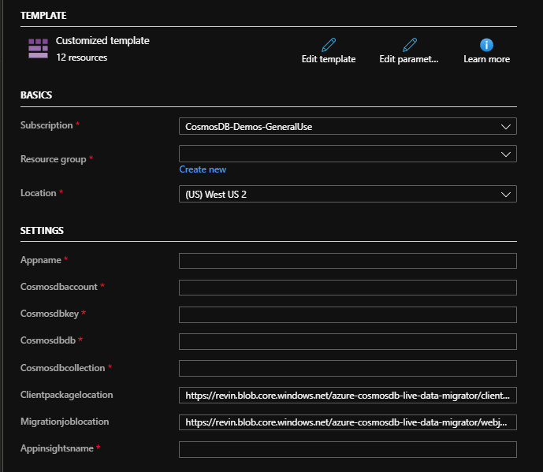

# Azure Cosmos DB Live Data Migrator
Simple and reliable service to transfer data from one Cosmos DB SQL API container to another in a live fashion.

## Features

The Cosmos DB Live Data Migrator provides the following features:

* Live data migration from a source Cosmos DB Container to a target Cosmos DB Container
* Ability to read and migrate from a given point of time in source
* Ability to scale up or scale down the number of workers while the migration is in progress
* Support for dead-letter queue where in the Failed import documents and the Bad Input documents are stored in the configured Azure storage location so as to help perform point inserts post migration
* Migration Monitoring web UI that tracks the completion percentage, ETA, Average insert rate etc:

## Getting Started

### Under the hood
- Uses change feed processor to read from the source container
- Uses bulk executor to write to the target container
- Uses ARM template to deploy the resources
- Uses App Service compute with P3v2 SKU in PremiumV2 Tier. The default number of instances is 5 and can be scaled up or down. 
- More details to be Added

### Quickstart

- Sign in to the Azure portal and select Create a resource option
- Find Template deployment (deploy using custom templates) and choose Buld your own template as below. 
	
	
	
	

- Copy the contents of [deployment template](MigrationAppResourceGroup/azuredeploy.json) and click Save.

- It may be a good practice to create a new Resource group so that it is easy to co-locate the different components of Service. Please make sure that the Resource group Region is same as the Region of Cosmos DB Source and Target collections.

- Provide an identifiable Appname and an Appinsights name

- The cosmos db Account information is to store the migration metadata and migration state. Please note that this is not the Source and Target Cosmos DB details and that will need to be entered at a later stage.

- The Clientpackagelocation and Migrationjoblocation are pre-populated with the zipped files to be published
	

- Open the webapp client resource and click on the URL (it will be of the format: https://appnameclient.azurewebsites.net)
	

- Add the Source and Target Cosmos DB connection details 

- Add the Cosmos DB connection details for Lease DB, which is used in the ChangeFeed process. Name the PK column as "id".

- [Optional] Add the Azure Blob Connection string and Container Name to store the failed / bad records. The complete records would be stored in this Container and can be used for point inserts.

- [Optional] Maximum data age in hours is used to derive the starting point of time to read from source container. In other words, it starts looking for changes after [currenttime - given number of hours] in source. The data migration starts from beginning if this parameter is not specified.
 

- Click on Start MIgration and it will automatically be taken to the Monitoring web UI. It provides the data migration stats and metrics such as counts, completion percentage, ETA and Average insert rate as seen below. 

	

- Click on Complete Migration once all the documents have been migrated to Target container
-
- The number of workers in the webapp service can be scaled up or down while the migration is in progress as shown below. The default is five workers.

	

- The Application Insights tracks additional migration metrics such as failed records count, bad record count and RU consumption and can be queried. 
	

### Failed / Bad Documents
- To be added 

### Querying App Insights metrics
- To be added

