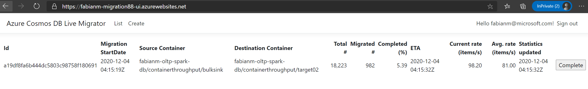

# Azure Cosmos DB Live Data Migrator
Simple and reliable service to transfer data from one Cosmos DB SQL API container to another in a live fashion.


## IMPORTANT

The purpose of this tool is to allow starting the migration of data significantly ahead of the actual cut-over date. Every migration started will use the change feed of the source container to listen on updates to be migrated to the destination. It is strongly advised to migrate the bulk of items using this mechanism at least several days before the cut-over-date to reduce the risk of unnecessary fire-drills due to unexpected delays or issues identified during migration. 


## Features

The Cosmos DB Live Data Migrator provides the following features:

* Live data migration from a source Cosmos DB Container to a target Cosmos DB Container
* Ability to read and migrate from a given point of time in source
* Support for mapping synthetic partition keys during migration
* Ability to scale up or scale down the number of workers while the migration is in progress
* Support for dead-letter queue where in the Failed import documents and the Bad Input documents are stored in the configured Azure storage location so as to help perform point inserts post migration
* Migration Monitoring web UI that tracks the completion percentage, ETA, Average insert rate etc:


## Getting Started

### Under the hood
- Uses change feed processor to read from the source container
- Uses bulk executor to write to the target container
- Uses ARM template to deploy the resources
- Uses App Service compute with P3v2 SKU in PremiumV2 Tier. The default number of instances is 5 and can be scaled up or down. 


### Quickstart

#### Prerequisites

- Open the Azure portal (https://portal.azure.com) and navigate to the "App registrations" blade
- Click "New registration"


​		

- Set “Name” to an identifier for you app (like “fabianm-migration01-app”). This registered app will be used to represent your migration app deployment in AAD.


- In most cases you should choose the “Accounts in this organizational directory only” option – at least if you only need to allow users within your AAD tenant to access the migration app.


- In the field for the “redirection Uri” please enter “https://<Resource-Group-Name>-ui.azurewebsites.net/signin-oidc” where “<Resource-Group-Name>” is the name of the resource group that you will use below when actually deploy the Azure resources for your migration app via the ARM template. The host-name for the Azure App Service will need to be globally unique – so it would be a good idea to add some prefix/suffix – I for example used “fabianm-migration01” as the resource group name for my test deployment – so the redirection Uri value would be https://fabianm-migration01-ui.azurewebsites.net/signin-oidc. This value can be changed later if it becomes necessary of course.


- Go to the “Authentication” tab

- In the “Logout URL” field please enter https://%3CResource-Group-Name%3E-ui.azurewebsites.net/signout-callback-oidc” (in my sample https://fabianm-migration01-ui.azurewebsites.net/signout-callback-oidc) This value can be changed later if it becomes necessary of course.
- Please also enable the “ID tokens” check-box in the “Implicit grant” section


- Please note (I actually mean copy & paste in some text file 😊) the “Application (client) ID” value. This ApplicationId is used to identify your newly created app registration in AAD and will need to be provided when deploying the ARM template below as one of the parameters.


- Last-but-not-least the newly registered app needs an “API permission” for “User.ReadBasic.All” to be able to provide the AAD login. I find the easiest way to add this is to Got to the App manifest and add the following json fragment in the “requiredResourceAccess/resourceAccess Array-node.

  >  {
  >
  > ​       "id": "b340eb25-3456-403f-be2f-af7a0d370277",
  >
  > ​       "type": "Scope"
  >
  >  }


- Please open the Manifest of the newly registered App and also note the value of the “publisherDomain” property (in my case because I am deploying the test app in the Microsoft tenant “microsoft.onmicrosoft.com”) - you will also need this when filling out the form to deploy the ARM template


#### Prerequisite validation

- An easy way to double-check whether the registered app has been configured properly is to use the “Integration assistant” blade. Please just choose the application type “Web app” – no API calls are made from the app so that can stay disabled.
- The results should look “all green” like below.


#### Deployment

Click the button below:

<br/>
<a href="https://portal.azure.com/#create/Microsoft.Template/uri/https%3A%2F%2Fraw.githubusercontent.com%2FTheovanKraay%2Fazure-cosmosdb-live-data-migrator%2Fmaster%2FMigration.ResourceGroup%2FMigrationServices.json" target="_blank">    </a>

<br/>

- You will then be presented will some fields you need to populate for the deployment.

- In the form pass in the following parameters

  - **<u>Subscription:</u>** Choose the subscription in which you want to deploy the migration app – this does not necessarily need to be the subscription of the Cosmos DB resources used as source or destination.

  - **<u>Resource-group:</u>** Create a resource group in which all the Azure resources needed for the migration-application will be deployed into. 

  - **<u>Region:</u>** Whenever possible please choose the (or one of the) write regions of your Destination CosmosDB account. So in my case I am deploying the migration app into the “West Europe” region, because my single-master CosmosDB account I want to migrate data into is located there. This is not a hard requirement but will provide the best throughput/latency.

  - **<u>Resource Name Prefix:</u>** All Azure resources that will be generated for the migration-app by this ARM template will derive the name of the resources from this prefix. For most resources the name of the created resources will be “<ResourceNamePrefix>” plus some short suffix indicating the type of the resource. For some resource types like StorageAccounts the restrictions for name length are so strict that instead of using the full prefix a unique prefix will be derived from this value.. In my sample I am going to use the same value as the name of the resource group “fabianm-migration01”

  - **<u>Default Source Database Account Name:**</u> This value will be provided as default for the source of any new migration you created. For each new migration task you will be able to override it – but for convenience the default value can be provided here (it can be change later in the AppSettings of the “<ResourceNamePrefix>-ui” App Service resource.

  - **<u>Default Source Database Account Connection String:</u>** Same as the account name – this is just for convenience. The Migration app will expect that a KeyVault resource created by this ARM template has the connection strings for all Cosmos DB accounts used as secrets in it. Asking for the default source account Connection String here is just for convenience so that we can put the right secret into the KeyVault when creating it. If you want to use different Cosmos DB accounts later you would simply need to add a corresponding secret with the name “<CosmosAccountName>- -CosmosDB-ConnectionString” and the Connection String of the Cosmos Account as value.

  - **<u>Default Destination Database Account Name:</u>** Same as for the “Default Source Database Account Name” just for the destination in case you want to move the data to another Cosmos Account.

  - **<u>Default Destination Database Account Connection String:</u>** Same as for the “Default Source Database Account Connection String” just for the destination in case you want to move the data to another Cosmos Account.

  - **<u>Allowed Users:</u>** One of the more tricky parameters. To keep this migration-app ARM template and the manual preparations necessary to allow AAD based authentication reasonably simple a very simple permission model is used. Instead of using RBAC (Role-based access control) with all of its configuration challenges the “Allowed Users” parameter will simply contain a list of user identities separated by the ‘|’ char for all users who should have access to the application. You can use either the email or ObjectId as “user identity” – but it will only work for users within the same tenant as the application is deployed in. This parameter can later also be modified in the ‘allowedUsers’ parameter in the AppSettings section of the  “<ResourceNamePrefix>-ui” App Service resource.

  - **<u>Migration/Executor/Monitor package parameters:</u>** these are prepopulated with the packages published as a “last known good” version. If needed or you want to contribute to this repo they can be manually generated (Folder publish). But in most cases the prepopulated values should be a good choice.

  - **<u>Aad App Registration Publisher Domain:</u>** Please fill in the “Publisher Domain” value noted down from the manifest when creating the App registration (see Prerequisits section)

  - **<u>Aad App registration Client Id:</u>** Please fill in the “Application (client) Id” value noted down when creating the App registration (see Prerequisits section)

    

  

- Click “Review+Create”
- Validation should pass – if so…
- Click “Create”


#### Known issues

- ***IMPORTANT** –it looks like occasionally the ARM template can result in conflicts during the deployment – please attempt a retry (by clicking the Redeploy button and using the same values for the parameters) – this usually works.*
- ***IMPORTANT** – in a couple of cases the migration-app shows an error “HTTP Error 500.30 - ANCM In-Process Start Failure” after the deployment. In this case it usually helps to toggle the “Runtime stack” (in the Settings/Configuration/General settings section of the <ResourceNamePrefix>-ui App Service resource between .Net and .Net Core (change the value, save and then change it back and save again). This seems to be related to some Windows Images only – will provide an update when this is better understood. But it is only necessary to do this once after finishing the deployment via the ARM template.*


#### First migration walk-through


- Open the *-ui resource and click on the URL (it will be of the format: https://resourcenameprefix-ui.azurewebsites.net)


- When clicking the “Create” button in the header/footer a new migration can be created. 

- The following parameters need to be filled in

  - **<u>Account</u>** – the names of the source and destination accounts – just the “short” names – not the full qualified name with *.documents.azure.com. If one of these accounts is not identical with one of the two default accounts provided when deploying the ARM template, the connection string needs to be added in the KeyVault (name of the secret would need to be “<CosmosAccountName>- -CosmosDB-ConnectionString” and the Connection String of the Cosmos Account as value.
  - **<u>DB</u>** – the names of the source and destination database
  - **<u>Container</u>** – the names of the source and destination containers
  - **<u>PK</u>** – The partition key definitions of the source and destination container. If your partition key is “/id” in the source container and you would want to use “/pk” in the destination container after migration you would enter “id” and “pk” in these fields.

- Click “Create/Start”

- *[Optional] The "Source Partition Key Attribute(s)" field is used for mapping partition key attributes from your source collection to your target collection. For example, if you want to have a dedicated or synthetic partition key in your new (target) collection named "partitionKey", and this will be populated from "deviceId" in your source collection, you should enter `deviceId` in "Source Partition Key Attributes" field, and `partitionKey` in the "Target Partition Key Attribute" field. You can also add multiple fields separated by a comma to map a synthetic key, e.g. add `deviceId,timestamp` in the "Source Partition Key Attribute(s)" field. Nested source fields are also supported, for example `Parent1/Child1,Parent2/Child2`. If you want to select an item in an array, for example:*

	```json
		{
			"id": "1",
			"parent": [
				{
					"child": "value1"
				},
				{
					"child": "value2"
				}
			]
		}
	```
	*You can use xpath syntax, e.g. `parent/item[1]/child`. In all cases of synthetic partition key mapping, these will be separated with a dash when mapped to the target collection, e.g. `value1-value2`. If no mapping is required, as there is no dedicated partition key field in your source or target collection, you can leave this field blank (but you must still enter the target collection's partition key field in "Target Partition Key Attribute").*




- To monitor the migration status(es) you can click on the “List” link in the header/footer. It will show a list with not-yet-completed migrations. If you have finished a migration (and the validation) you can click on the “Complete” button and the migration won’t be shown up in the list anymore.

- To update the migration status just hit refresh/F5 in the browser. 

	

- Click on Complete Migration once all the documents have been migrated to Target container. If you are doing a live migration for the purpose of changing partition key, you should not complete the migration until you have made any required changes in your client code based on the new partition key scheme. 

- The number of workers in the webapp service can be scaled up or down while the migration is in progress as shown below. The default is five workers.

	

- The Application Insights tracks additional migration metrics such as failed records count, bad record count and RU consumption and can be queried. 
	


### Failed / Bad Documents
- TBA 


### Troubleshooting
- All App Services used by the migration app will log into the ApplicationInsights resource in the same resource group. So the two most efficient way for troubleshooting are

  - AppInsights: Run the following query in the “Logs” section to get the most recent errors

    `traces | where message contains 'exception' | top 100 by timestamp desc`

  - Log Streaming: Logging to the files system has been enabled for all three “App Service” resources. Go to the “Monitoring/Log Stream” section in any of the “App Service” resources to take a look at the real-time logs.


